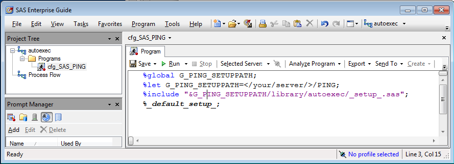

[](https://zenodo.org/badge/latestdoi/79137006)
PING
====

Library of macro/function utilities implemented in R/SAS/Stata for 
*statistical data handling and processing in production environments*.
---

**About**

`PING` Is Not GSAST! 

<table align="center">
    <tr> <td align="left"><i>documentation</i></td> <td align="left">available at: https://gjacopo.github.io/PING/</td> </tr> 
    <tr> <td align="left"><i>version</i></td> <td align="left">0.9</td> </tr> 
    <tr> <td align="left"><i>since</i></td> <td align="left">2016</td> </tr> 
    <tr> <td align="left"><i>contributors</i></td> <td align="left">see the list <a href="https://gjacopo.github.io/PING/d3/df9/mainpage_about.html">here</a></td> </tr> 
    <tr> <td align="left"><i>license</i></td> <td align="left"><a href="https://joinup.ec.europa.eu/sites/default/files/eupl1.1.-licence-en_0.pdfEUPL">EUPL</a></td> </tr> 
</table>

**Usage**

Check the [usage page](https://gjacopo.github.io/PING/dd/dcb/mainpage_usage.html).

###### Running PING SAS macros 

Currently, SAS macros in `PING` library are made available through the `autocall` functionality, _i.e._ 
they are retrieved by providing SAS with their actual location. In the future, they will be saved as stored 
processes (`/ store` option) and, therefore, will be retrieved through the `MSTORED` option. 

There are then different ways to set your environment so as to be able to load and run available `PING` macros, 
depending whether **you are already running a SAS session**, _e.g._ employing:
* the [autocall option](#SASautocall),
* a [setup macro](#macroSASautocall),

**or not**, _e.g._ launching SAS:
* with an [autoexec file](#SASautoexec),
* with SAS Enterprise Guide and an [autoexec workflow](#EGautoexec).

Hence, depending on your context, you can follow any of the methods described in the instructions below. 
Note that our preference for the settings goes to the last two methods. In particular, the 
[last one](#EGautoexec) being preferred for users running on SAS EG.

####### (1) <a name="SASautocall"></a> Use `autocall` directly

You will first need to set the path of your install, then you will be able to configure the `SASAUTOS` 
environment (defining where to look for macros) using the corresponding keyword with `options` as follows:

	%let G_PING_ROOTPATH=</your/server/>; 
	options MAUTOSOURCE;
	options SASAUTOS =(SASAUTOS 
						"&G_PING_ROOTPATH/library/pgm/" 		
						"&G_PING_ROOTPATH/library/test" 			
						"&G_PING_ROOTPATH/5.1_Integration/pgm/"
						"&G_PING_ROOTPATH/5.3_Validation/pgm/"
						"&G_PING_ROOTPATH/5.5_Extraction/pgm/"
						"&G_PING_ROOTPATH/5.5_Estimation/pgm/"
						"&G_PING_ROOTPATH/5.7_Aggregates/pgm/"
						"&G_PING_ROOTPATH/7.1_Upload/pgm/"
						"&G_PING_ROOTPATH/7.3_Dissemination/pgm/"
						"&G_PING_ROOTPATH/7.4_Visualisation/pgm/"
						"&G_PING_ROOTPATH/7.4_Services/pgm/"
						);

This way you will be able to run `PING` macros. 
However, this command alone will not allow you to load/set all default configuration parameters (_e.g._ global variables) associated to the `PING` library.

(2) <a name="macroSASautocall"></a> Use a default setup (_e.g._, `_default_setup_`) macro

In order to load all PING macros, as well as associated default configuration parameters, we provide a 
configuration file named `_setup_.sas` (documentation [here](#sas_setup_); file is located in the directory 
`library/autoexec`). You can then set your SAS environment with something similar to the following command:

	%let G_PING_SETUPPATH=</your/server/PING/>; /* again, specific to our own case */
	%include "&G_PING_SETUPPATH/library/autoexec/_setup_.sas";	
	%_default_setup_;
	
Note however that this will work only if you have not already set your `SASAUTOS` environment using (_e.g._ 
using the `options SASAUTOS` command like above) since `SASAUTOS` can be set once only. So as to avoid launching
the `options SASAUTOS` several times, you can put the setup commands above inside a conditional macro as follows, 
and launch it during your SAS session (or every time you use a `PING` macro, since it will have no effect, though 
it will not be very elegant), _e.g._:


	%macro _ping_setup;
		%if %symexist(G_PING_ROOTPATH) EQ 0 %then %do; 
			%if %symexist(G_PING_SETUPPATH) EQ 0 %then 	%let G_PING_SETUPPATH=</your/server/PING>; 
			%include "&G_PING_SETUPPATH/library/autoexec/_setup_.sas";
			%_default_setup_;
		%end;
	%mend _ping_setup;
	%_ping_setup;

Note moreover that you can implement your own default configuration and load it similarly.
	
(3) <a name="SASautoexec"></a> Use an `autoexec` file to launch your SAS session

The commands above can be inserted into a file that will be automatically loaded (and ran) by SAS at launch time. 
This feature is enabled by the so-called `autoexec` option (see 
["Customizing Your SAS Session by Using Configuration and Autoexec Files"](http://support.sas.com/documentation/cdl/en/hostunx/63053/HTML/default/viewer.htm#p13flc1vsrqwr8n1vutzds8rp3t0.htm)).
In practice, a file (named `cfg_SAS_PING.sas` with SAS version 9.2) shall be saved in your `HOME` directory (or any 
other location), or created on-the-fly, so as to contain the following settings (similar to what is described 
above), _e.g._:

	%global G_PING_SETUPPATH
	%let G_PING_SETUPPATH=</your/server/PING/>;
	%include "&G_PING_SETUPPATH/library/autoexec/_setup_.sas";
	%_default_setup_;
 
Then, SAS can be launched by specifying this file in the `-autoexec` option of the inline command, _.e.g._ (in 
general, you will need to be on the SAS server for this command to run):
	
```bash
	sas_autoexec </your/server/PING/>/library/autoexec/cfg_SAS_PING.sas
```
	
granted that the location of SAS software has been added to your `PATH` (otherwise, in our case we would run 
`<SAS_SERVER>/sas/bin/SAS92/SASFoundation/9.2/sas`), and considering the configuration file has been saved 
as `library/autoexec/cfg_SAS_PING.sas`.

Further, we provide the bash script `sas_ping.sh` (located in practice in library/bin/`) 
as an alias for this operation to be performed on-the-fly (hence, no need to create the configuration file beforehand), 
_e.g._:

	bash </your/server/PING/>/library/bin/sas_ping.sh
	
will launch your SAS session with all desired settings. 

(4) <a name="EGautoexec"></a> Use an `autoexec` workflow with your SAS EG session

The `autoexec` feature  of SAS EG can be used to load all `PING` settings, _.e.g_ by creating an `autoexec` workflow in your 
project, and either:
* embedding in it a copy of, or inserting a link to, the file `cfg_SAS_PING.sas` (**recommended**), or

* inserting a reference to the default configuration file `_setup_.sas` (located in `library/autoexec`) 
and linking to an embedded program that runs (only) `%%_default_setup_;`.


SAS EG will then submit the programs associated to the `autoexec` workflow when your Workspace Server session is 
created on the SAS Server (see ["Writing code in SAS Enterprise Guide"](http://www.lexjansen.com/wuss/2013/83_Paper.pdf)). 
This occurs at launch time of SAS EG.

<a name="Stata"></a>
###### Running PING Stata functions

<a name="R"></a>
###### Running PING R functions

`R` functions are not defined into a package. They need to be loaded manually.

**<a name="References"></a>References**

* Grazzini J. and Lamarche P. (2017): 
  [**Production of social statistics... goes social!**](https://www.conference-service.com/NTTS2017/documents/agenda/data/abstracts/abstract_124.html), 
  in _Proc.  New Techniques and Technologies for Statistics_.
